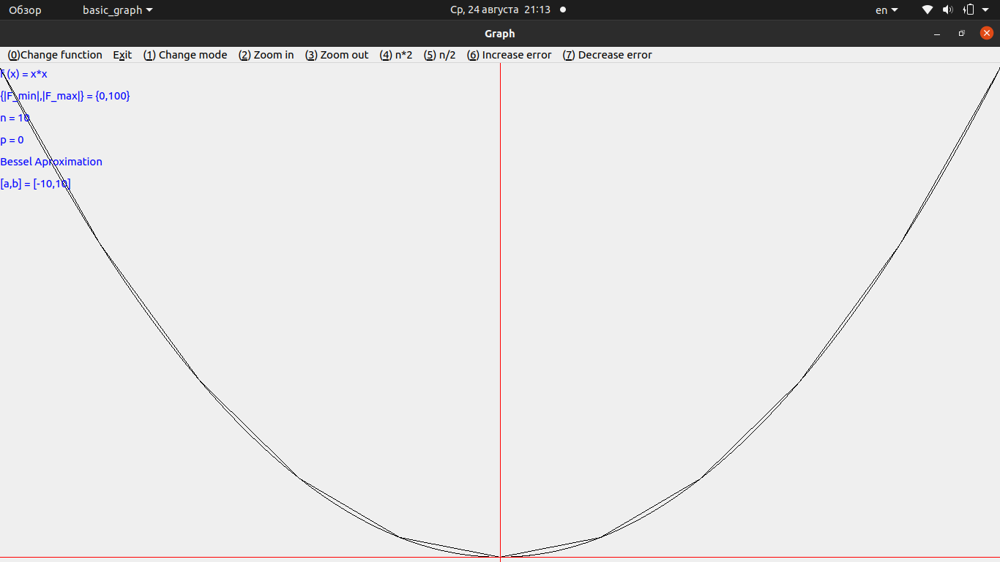
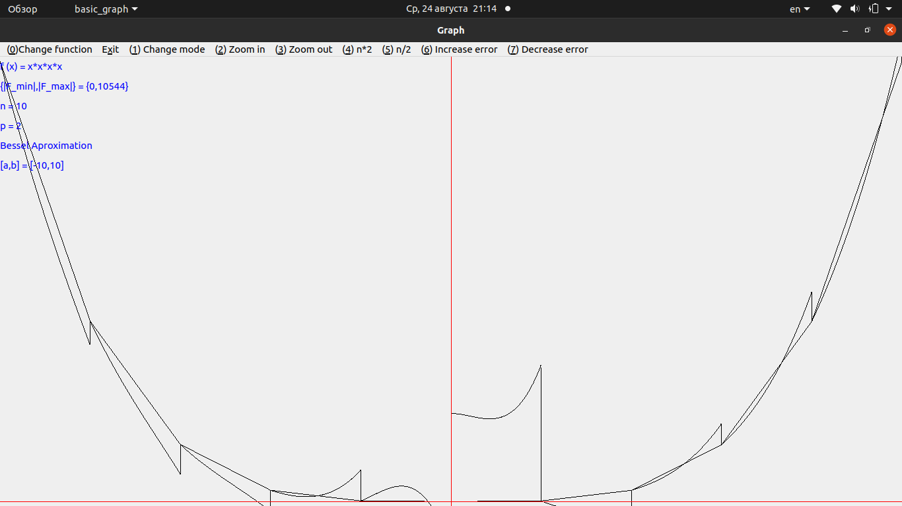
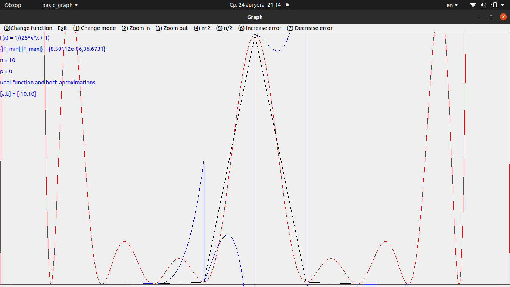
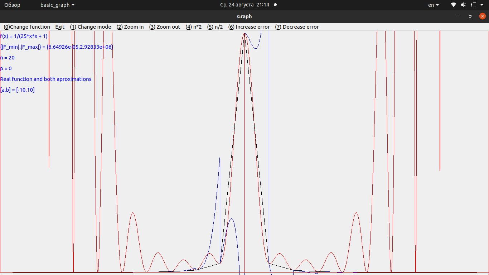

# Приближение одномерной функции с помощью формулы Ньютона с кратными узлами и кусочными многочлнами Бесселя
Данная программа предназначена для построения приближений заданных функций с помощьюд кусочных многочленов Бесселя и формулы ньютона с Кратными узлами(кратность фиксирована и равна 2)
## Сборка
Для сборки программы воспользуйтесь `make`. Для этого воспользуйтесь командой 
```
make
```
## Запуск
Запуск программы производится командой
```
./basic_graph a b n k
```
Где:
- a - начало отрезка приближения
- b - конец отрезка приближения
- n - количество изначальных точек приближения
- k - номер начальной функции:
- - 0 - f(x) = 1
- - 1 - f(x) = x
- - 2 - f(x) = x*x
- - 3 - f(x) = x*x*x
- - 4 - f(x) = x*x*x*x
- - 5 - f(x) = exp(x)
- - 6 - f(x) = 1/(25*x*x + 1)
Программа работает в 4 разных режимах
1. Отрисовка изначальной функции и приближения с помощью многочленов Бесселя
2. Отрисовка изначальной функции и приближения с помощью формулы Ньютона
3. Отрисовка изначальной функции и приближений сразу по двумя методам
4. Отрисовка невязок приближений
## Тесты
Результаты различных запусков приведены ниже




##Описание файлов
1. main.cpp - основной файл программы
2. window.cpp - файл содержащий в себе весь функционал для отрисовки
3. besselaproximator.cpp - файл содержащий в себе класс позволяющий произвести приближение с помощью кусочных многочленов Бесселя
4. newtonaproximator.cpp - файл содержащий в себе класс позволяющий произвести приближение с помощью формулы Ньютона с кратными узоами
Остальные файлы являются сгенерированными средой QTCreator и служат для сборки проекта