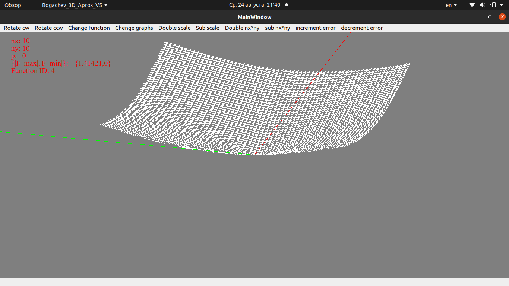

# Приближение двумерной функции с помощью метода конечных элементов
Данная программа предназначена для построения приближений двумерной функции с моиощью метода конечных элементов с итерационным решением и использованием формата хранения и использования матриц MCSR
## Сборка
Для сборки программы воспользуйтесь `make`. Для этого воспользуйтесь командой 
```
make
```
## Запуск
Запуск программы производится командой
```
./Bogachev_3D_Aprox_v5 file_name nx ny start_function eps p
```
Где:
- file_name - имя файла с конфигурацией области в которой будет происходить приближение
- nx - количество точек приближения по оси x
- ny - количество точек приближения по оси y
- start_function - номер начальной функции для приближения
- 0. f(x,y) = 1
- 1. f(x,y) = x
- 2. f(x,y) = y
- 3. f(x,y) = x+y
- 4. f(x,y) = sqrt(x^2 + y^2)
- 5. f(x,y) = x^2 + y^2
- 6. f(x,y) = exp(x^2 - y^2)
- 7. f(x,y) =  1 / (25/(x^2 + y^2) + 1)
- eps - число после которого итерационный алгоритм прекращает свою работу
- p - число потоков производящих решение

Программа работает в 3 разных режимах
1. Отрисовка изначальной функции
2. Отрисовка приближения изначальной функции
3. Отрисовка невязки приближенной функции
## Тесты
Результаты различных запусков приведены ниже



## Описание файлов
1. grid.cpp - файл ответственный за построение сетки для отрисовки
2. openglwidget.cpp - файл хранящий в себе функционал для работы виджета с OpenGL, для отрисовки. Также производит надзор за потоками для решения
3. point.cpp - файл хранящий в себе класс одной точки для отрисовки
4. thread_kernel.cpp - файл 'ядро' для потоков. Запускаются из под надзора openglwidget.cpp и производят вычисоения для построения приближений
5. aproximator.cpp - файл содержащий в себе весь функционал для построения приближений. Необходим для работы thread_kernel.cpp
6. triangle.cpp - класс описывающий треугольники для отрисовки
Остальный файлы сгенерированы средой QTCreator и нужны для сборки.
## Ошибки
1. По окончанию работы программы, врщникает сообщение об ошибке сегментации, однако деюбаг показывает что это было вызвано функцией относящейся к стеку Qt/OpenGL, из-за чего исправить ее не представляется возможным.